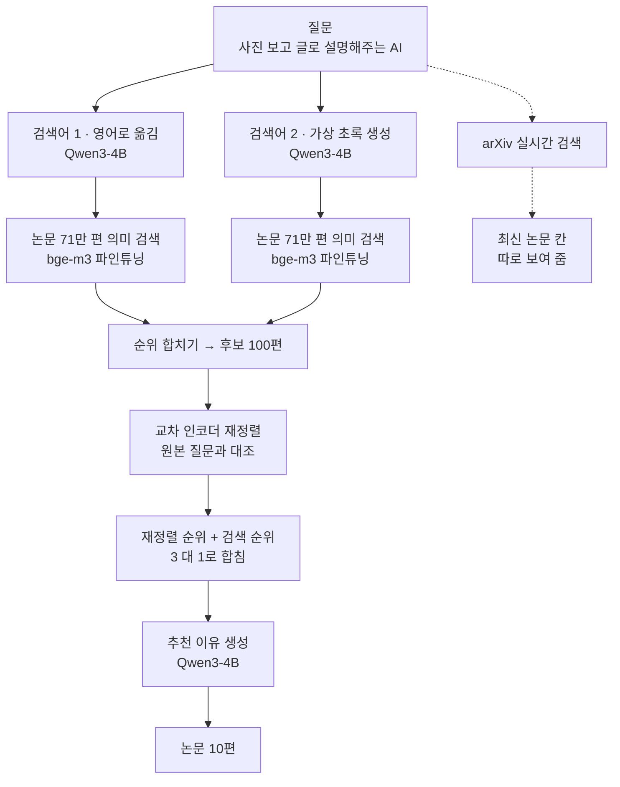
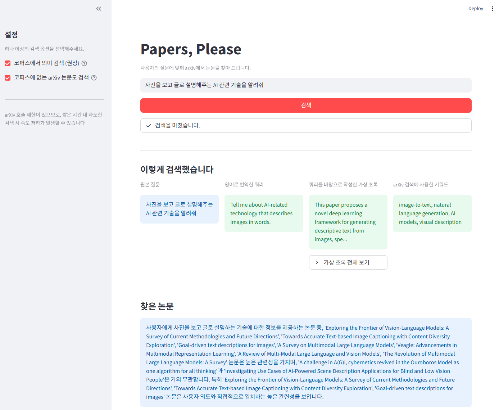

# Papers, Please

한국어나 일상어로 물어도 arXiv 논문을 찾아 주는 검색 서비스입니다. 비전문가를 위한
논문 검색 시스템입니다.

논문을 찾을 때 걸림돌이 되는 것은 읽고 싶은 논문이 어떤 제목으로 쓰여 있는지 모른다는
점입니다. "사진 보고 글로 설명해주는 AI"라고 검색창에 입력해도 논문에는 `image captioning`이라고
쓰여 있습니다. 두 표현에는 겹치는 단어가 없어서 키워드 검색으로는 찾을 수 없습니다.
한국어로 검색하면 결과가 아예 나오지 않기도 합니다.

Papers, Please는 질문을 그대로 키워드 검색에 넣는 대신 다음 순서로 처리합니다.

1. 질문을 영어 학술 문장으로 옮깁니다
2. 그 질문에 답할 법한 가상의 논문 초록을 생성합니다
3. 두 검색어로 논문 716,183편을 의미 기반으로 검색합니다
4. 두 결과를 하나의 후보 목록으로 합칩니다
5. 교차 인코더가 사용자의 원본 질문과 대조해 순위를 다시 매깁니다
6. 논문마다 추천 이유를 생성해 10편을 제시합니다



arXiv 실시간 검색 결과는 추천 목록에서 같이 보여주지 않고 '최신 논문' 칸에서 따로 보여 줍니다.
이 채널의 쓰임은 정확도가 아니라 색인에 없는 최신 논문을 가져오는 데 있습니다.

---

## 설치

### 1. 필요한 사양

| 항목 | 값 |
|---|---|
| 운영체제 | 리눅스 · WSL · macOS · 윈도우 |
| 파이썬 | 3.11 이상 |
| 디스크 | 약 8GB |
| 시스템 메모리 | 16GB 이상 |
| 그래픽 카드 | 4GB 이상. 없으면 CPU로 동작 |
| 인터넷 | 모델과 색인 내려받기, arXiv 실시간 검색에 필요 |

시스템 메모리 16GB는 색인 2.9GB를 통째로 올리기 때문에 필요합니다. 그래픽 카드는
검색 중 최대 3.3GB를 사용합니다.

### 2. Ollama 설치

번역, 가상 초록 생성, 추천 이유 생성에 사용합니다. 파이썬 패키지와 별개로 데몬을
설치합니다.

```bash
# 리눅스 · WSL
curl -fsSL https://ollama.com/install.sh | sh

# macOS
brew install ollama

# 윈도우는 https://ollama.com/download 에서 설치 파일을 받습니다
```

데몬을 띄웁니다. 터미널 하나를 이 명령에 쓰고 켜 둔 채로 둡니다.

```bash
ollama serve
```

### 3. 실행 준비

파이썬 패키지를 설치합니다. GPU를 쓰는 경우 torch를 먼저 CUDA 빌드로 설치합니다.

```bash
pip install torch --index-url https://download.pytorch.org/whl/cu126
pip install -r requirements.txt
```

나머지는 명령 한 줄로 끝납니다. 언어 모델을 받고, 논문 코퍼스와 의미 검색 색인을
내려받은 뒤, 조건이 모두 갖춰졌는지 확인까지 합니다.

```bash
python run.py init
```

```
  준비를 시작합니다

  ✓ 파이썬 3.11 이상  3.13.9
  ✓ 파이썬 패키지  7개 확인
  ✓ 디스크 여유 8GB  885.6GB 남음

  [1/3] Ollama 모델
    $ ollama pull qwen3:4b

  [2/3] 논문 코퍼스
    GreenBed4725/arxiv-cs2021-corpus -> data/corpus

  [3/3] 의미 검색 색인
    GreenBed4725/arxiv-cs2021-embeddings-bge-m3 -> data/embeddings
```

약 6.5GB를 다운 받습니다. 시간이 다소 걸립니다. 중간에 끊겨도 같은 명령을
다시 실행하면 중단된 부분부터 이어서 받을 수 있습니다.

질문 임베딩 모델
([GreenBed4725/bge-m3-arxiv-cs-retriever](https://huggingface.co/GreenBed4725/bge-m3-arxiv-cs-retriever))은
앱을 처음 실행할 때 자동으로 내려받습니다.

일부만 다시 다운 받으려면 아래 항목을 붙입니다.

| 항목 | 내용 |
|---|---|
| `--skip-ollama` | 언어 모델 내려받기를 건너뜁니다 |
| `--skip-download` | 코퍼스와 색인 내려받기를 건너뜁니다 |

### 4. 준비 상태 확인

실행 전, 실행에 필요한 조건이 갖춰졌는지 확인할 수 있습니다.

```bash
python run.py checklist
```

```
  실행 조건 확인
  ------------------------------------------------------------------
  ✓  파이썬 3.11 이상    3.13.9
  ✓  파이썬 패키지       7개 확인
  ✓  디스크 여유 8GB     885.6GB 남음
  ✓  Ollama 데몬         모델 4개 등록됨
  ✓  Ollama qwen3:4b     등록됨
  ✓  논문 코퍼스         1.03GB
  ✓  의미 검색 색인      716,183편, 2.93GB
  ✓  색인과 코퍼스의 짝  식별자 일치
  ✓  질문 임베딩 모델    GreenBed4725/bge-m3-arxiv-cs-retriever
  ------------------------------------------------------------------

  모두 준비되었습니다. streamlit run app.py로 실행하십시오.
```

### 5. 코퍼스와 색인을 직접 만들기

`python run.py init`이 내려받는 것을 직접 만들 수도 있습니다.
[Kaggle arXiv 데이터셋](https://www.kaggle.com/datasets/Cornell-University/arxiv)에서
`arxiv-metadata-oai-snapshot.json`(약 4GB)을 받아 `data/corpus/`에 둡니다.

```bash
python -m src.retrieval.corpus \
    --kaggle data/corpus/arxiv-metadata-oai-snapshot.json \
    --out data/corpus/corpus-cs2021.jsonl \
    --prefixes cs. stat.ML eess. --min-year 2021 --sample 0
```

716,183편, 약 1GB가 나옵니다. 10분쯤 걸립니다.

이어서 색인을 만듭니다. GPU로 약 3시간, 결과는 2.9GB입니다.

```bash
python -m src.retrieval.local_index \
    --corpus data/corpus/corpus-cs2021.jsonl \
    --model GreenBed4725/bge-m3-arxiv-cs-retriever \
    --out data/embeddings/cs2021-ft
```

파인튜닝 모델 대신 원본 `BAAI/bge-m3`로 만드는 경우 `--model`을 빼고
`--out data/embeddings/cs2021`로 지정한 뒤, `app.py` 맨 위의 두 값을 함께 바꿉니다.

```python
LOCAL_INDEX = "cs2021"
FUSE_RERANK_WEIGHT: float = 0.0
```

---

## 실행 방법

### 웹 화면

```bash
ollama serve                       # 아직 띄우지 않았으면
streamlit run app.py
```

브라우저에서 `http://localhost:8501`이 열립니다.

### 성능 평가

```bash
# 파이프라인을 돌려 결과를 저장합니다
python -m evaluation.pipeline_eval --queries data/eval/test.jsonl \
    --channels local_dense local_hyde --rewriter service \
    --k 100 --rerank cross --rerank-depth 100 --out runs/test_run.jsonl

# 저장된 결과를 보고합니다
python -m evaluation.report --run runs/test_run.jsonl \
    --queries data/eval/test.jsonl --grades data/eval/grades_test.jsonl

# 두 실행을 짝지어 비교합니다. 기준선을 맨 앞에 둡니다
python -m evaluation.report --run results/test_arxiv_only_raw.jsonl \
    results/test_ft_fused.jsonl --queries data/eval/test.jsonl

# 응답 시간을 잽니다
python -m evaluation.pipeline_eval --bench-service --n 5
```

저장된 검색 결과에 설정만 바꿔 다시 집계할 수 있습니다. 검색을 다시 하지 않으므로
빠르고 arXiv도 다시 호출하지 않습니다.

```bash
# 설정만 바꿔 재집계합니다
python -m evaluation.pipeline_eval --report-only runs/test_run.jsonl --rrf-k 30

# 채널 조합만 갈라 봅니다
python -m evaluation.pipeline_eval --report-only runs/test_run.jsonl \
    --use-channels local_dense --rerank cross
```

자세한 평가 방법은 [evaluation/README.md](evaluation/README.md)에 있습니다.

### 학습

```bash
# 쿼리 변환기 - 지도 파인튜닝 다음에 선호 학습
python -m training.train sft --output-dir models/query-translator-sft
python -m training.train dpo --sft-adapter models/query-translator-sft/checkpoint-54 \
    --output-dir models/query-translator-dpo

# 검색 모델 파인튜닝
python -m training.build_retrieval_pairs --out data/training/train_retriever.jsonl
python -m training.train embed --output-dir models/retriever-ft
```

학습한 쿼리 변환기를 서비스에서 쓰려면 Ollama에 등록합니다. llama.cpp의 변환
스크립트가 필요합니다.

```bash
python -m training.export ollama --llama-cpp ~/llama.cpp --grades basic
```

등록하지 않아도 앱은 동작합니다. arXiv 채널이 변환 없이 원본 질문으로 검색하고 화면에
그렇게 표시합니다. 추천 논문 10편은 이 모델을 사용하지 않습니다.

재정렬 모델의 float16 사본을 미리 만들어 두면 적재가 5.4초에서 1.8초로 줄어듭니다.

```bash
python -m training.export fp16
```

---

## 폴더 구조

| 위치 | 내용 |
|---|---|
| `app.py` | 웹 화면 (Streamlit) |
| `src/rewriter/` | 쿼리 변환 — 번역 · 가상 초록 · 학습한 모델 · 특정 논문 지목 |
| `src/retrieval/` | 검색 — 코퍼스 · 로컬 색인 · arXiv · 순위 합치기와 재정렬 |
| `src/recommend_agent/` | 추천 이유 생성 |
| `src/config.py` | 경로와 모델 이름 등 전역 설정값 |
| `evaluation/` | 평가셋 제작 · 파이프라인 실행 · 지표 · 보고 |
| `training/` | 학습 — 쿼리 변환기 · 검색 모델 · 재정렬기 |
| `data/eval/` | 평가셋 4개 (`dev` · `test` · `grades_dev` · `grades_test`) |
| `data/corpus/` | 논문 코퍼스 (저장소에 포함되지 않습니다) |
| `data/embeddings/` | 의미 검색 색인 (저장소에 포함되지 않습니다) |
| `results/` | 확정된 측정 결과. [설명](results/README.md) |

서비스 동작에 관여하는 주요 설정값은 `app.py` 맨 위에 모여 있습니다.

| 값 | 기본 | 내용 |
|---|---|---|
| `LOCAL_INDEX` | `cs2021-ft` | 사용할 색인. 질문 임베딩 모델은 색인 파일에서 읽습니다 |
| `DEPTH_LOCAL` | 100 | 검색어마다 가져올 후보 편수 |
| `RERANK_DEPTH` | 100 | 재정렬에 넣을 최대 후보 편수 |
| `FUSE_RERANK_WEIGHT` | 3.0 | 재정렬 순위와 검색 순위를 합칠 때 재정렬 쪽 가중치 |
| `MIN_RERANK_SCORE` | 0.002 | 이 아래는 "관련성이 낮아 접어 둔" 자리로 내립니다 |
| `TOP_K` | 10 | 보여 줄 논문 편수 |

---

## 사용된 모델

| 자리 | 모델 | 실행 방식 | 그래픽 메모리 |
|---|---|---|---|
| 번역 · 가상 초록 · 추천 이유 | `qwen3:4b` | Ollama 4비트 | 3.25GB |
| arXiv 검색어 생성 | `Qwen3-4B-Instruct-2507` + LoRA 병합 4비트 | Ollama `papers-rewriter` | 3.2GB |
| 재정렬 | `BAAI/bge-reranker-v2-m3` | float16 사본 | 1.24GB |
| 질문 임베딩 | [`GreenBed4725/bge-m3-arxiv-cs-retriever`](https://huggingface.co/GreenBed4725/bge-m3-arxiv-cs-retriever) | CPU float32 | 0 |

질문 임베딩 모델은 `BAAI/bge-m3`를 이 코퍼스에 맞춰 LoRA로 파인튜닝한 것입니다. 정답
논문 한 편과 검색 상위에 함께 올라온 관련도 낮은 논문 여섯 편을 묶은 학습쌍을 사용했고,
손실 함수는 MultipleNegativesRankingLoss입니다.

### 그래픽 메모리

검색 한 번은 서로 겹치지 않는 구간으로 나뉘고, 구간이 바뀔 때 반대편 모델을 내립니다.
언어 모델 하나가 3.25GB라서 재정렬 모델과 같은 시각에 올라가면 4.76GB가 되기 때문입니다.

| 구간 | 올라가는 모델 | 사용량 |
|---|---|---|
| 1 · 논문 지목 · 번역 · 가상 초록 | Ollama `qwen3:4b` | 3.26GB |
| 1-2 · arXiv 검색어 변환 | Ollama `papers-rewriter` (교체) | 3.23GB |
| 2 · 로컬 의미 검색 · 재정렬 | 재정렬 모델만 | 1.49GB |
| 3 · 추천 이유 | Ollama `qwen3:4b` (교체) | 3.51GB |
| 검색이 끝난 뒤 | CUDA 컨텍스트만 | 0.27GB |

기본 설정에서 최대 3.3GB를 사용합니다. 검색하지 않을 때는 거의 쓰지 않습니다.

### 공개한 자료

| 저장소 | 종류 | 내용 |
|---|---|---|
| [GreenBed4725/bge-m3-arxiv-cs-retriever](https://huggingface.co/GreenBed4725/bge-m3-arxiv-cs-retriever) | 모델 | 파인튜닝한 검색 모델 |
| [GreenBed4725/arxiv-cs2021-corpus](https://huggingface.co/datasets/GreenBed4725/arxiv-cs2021-corpus) | 데이터셋 | 논문 코퍼스 716,183편 |
| [GreenBed4725/arxiv-cs2021-embeddings-bge-m3](https://huggingface.co/datasets/GreenBed4725/arxiv-cs2021-embeddings-bge-m3) | 데이터셋 | 의미 검색 색인 |

---

## 실행 화면



화면 사진을 `assets/screenshot.png`에 넣으면 여기에 표시됩니다. 찍는 방법은
[assets/README.md](assets/README.md)에 있습니다.

---

## 검색 성능

### 평가 방법

평가셋은 논문에서 질문을 거꾸로 생성해 만들었습니다. 모델에게 제목을 주지 않고 초록만
주어, 그 논문을 아직 찾지 못한 사람의 자리에서 질문을 쓰게 했습니다. 제목을 함께 주면
모델이 제목의 낱말 조합을 재현해 성능이 실제보다 높게 측정됩니다.

- 시험용 342문항 (`data/eval/test.jsonl`) — 확정 판정에만 사용합니다
- 개발용 348문항 (`data/eval/dev.jsonl`) — 설정을 바꿔 보는 탐색에 사용합니다
- 같은 논문에 한국어와 영어 질문을 짝지어 만들어, 언어별 차이가 논문 차이와 섞이지
  않도록 했습니다
- 난이도 세 단계 — `easy` 대학원생의 학술어, `medium` 학부연구생, `hard` 1~2학년의 일상어

주 지표는 Recall@10입니다. 상위 10편 안에 그 질문을 만든 논문이 들어왔는지를 봅니다.
성능 차이가 우연인지는 같은 문항끼리 짝지은 부트스트랩 검정으로 확인했습니다. p가
0.05보다 크면 "차이가 없다"가 아니라 "있는지 없는지 모른다"로 적었습니다.

### 적용 전후 (시험용 342문항, Recall@10)

| 무리 | 단순 arXiv API 키워드 검색 | 이 프로젝트 | 차이 |
|---|---|---|---|
| 전체 | 0.190 | 0.658 | +0.468 |
| easy | 0.500 | 0.904 | +0.404 |
| medium | 0.061 | 0.737 | +0.675 |
| hard | 0.009 | 0.333 | +0.325 |
| 한국어 | 0.076 | 0.661 | +0.585 |
| 영어 | 0.304 | 0.655 | +0.351 |

여섯 무리 모두 p < 0.001이고, 전체 신뢰구간은 [+0.415, +0.520]입니다. 상위 10편 안에
정답 논문이 들어온 문항은 65개에서 225개로 늘었습니다.

기준선에서 한국어 질문 171개 중 128개(74.9%)는 검색 결과가 한 편도 반환되지 않았습니다.
영어는 0건인 문항이 없었습니다. 이 프로젝트는 사전 색인된 논문 전체와 유사도를 계산하므로
결과가 없는 문항이 발생하지 않습니다.

- 전: `results/test_arxiv_only_raw.jsonl` — 사용자 질문을 그대로 arXiv API에 입력
- 후: `results/test_ft_fused.jsonl` — 현재 서비스 구성

두 파일이 저장되어 있으므로 직접 다시 계산할 수 있습니다.

```bash
python -m evaluation.report --run results/test_arxiv_only_raw.jsonl \
    results/test_ft_fused.jsonl --queries data/eval/test.jsonl
```

### 무엇이 성능을 만들었는가

개발용 348문항에서 단계마다 하나씩 더해 가며 측정했습니다.

| 구성 | 전체 | easy | medium | hard | 한국어 | 영어 |
|---|---|---|---|---|---|---|
| ① 단순 arXiv 키워드 검색 | 0.086 | 0.233 | 0.026 | 0.000 | 0.017 | 0.155 |
| ② 쿼리 변환 + arXiv 검색 | 0.284 | 0.586 | 0.241 | 0.026 | 0.270 | 0.299 |
| ③ 로컬 의미 검색만 | 0.428 | 0.724 | 0.474 | 0.086 | 0.368 | 0.489 |
| ④ ③ + 한국어를 영어로 옮김 | 0.468 | 0.784 | 0.500 | 0.121 | 0.448 | 0.489 |
| ⑤ ④ + 가상 초록 검색어 추가 | 0.457 | 0.784 | 0.457 | 0.129 | 0.443 | 0.471 |
| ⑥ ⑤ + 교차 인코더 재정렬 | 0.575 | 0.914 | 0.629 | 0.181 | 0.575 | 0.575 |
| ⑦ ⑥ + 파인튜닝 검색 모델 | 0.618 | 0.914 | 0.672 | 0.267 | 0.615 | 0.621 |
| ⑧ ⑦ + 순위 합치기 3:1 | 0.635 | 0.914 | 0.681 | 0.310 | 0.632 | 0.638 |

가장 큰 두 몫은 arXiv 키워드 검색을 로컬 의미 검색으로 바꾼 것(+0.144, p<0.001)과
교차 인코더 재정렬(+0.118, p<0.001)입니다. 둘이 전체 상승분의 절반가량을 차지합니다.

한국어와 영어의 격차가 좁혀지는 과정은 다음과 같습니다.

```
①  한국어 0.017  영어 0.155   차이 0.138
④  한국어 0.448  영어 0.489   차이 0.041   <- 번역을 넣은 자리
⑧  한국어 0.632  영어 0.638   차이 0.006
```

### 응답 시간 (질문 5개, arXiv 채널 끔)

| 단계 | 중앙값 | 최대 | 비중 |
|---|---|---|---|
| 추천 이유 생성 | 10.8초 | 13.3초 | 59% |
| 재정렬 | 2.2초 | 2.9초 | 12% |
| 한국어를 영어로 옮기기 | 2.1초 | 2.9초 | 11% |
| 가상 초록 만들기 | 1.0초 | 2.6초 | 5% |
| 로컬 의미 검색 | 0.8초 | 1.1초 | 4% |
| 합계 | 18.3초 | 19.9초 | |

기준으로 삼은 30초를 넘은 질문은 없었습니다. 시작할 때 색인을 올리는 12.3초는 한 번만
듭니다. 응답 시간의 59%가 추천 이유 생성에 쓰입니다.

### 함께 적어 두는 것

- 일상어 층(hard)은 0.333으로 여전히 낮습니다. 다만 이 층의 질문 중 상당수에는 정답
  논문이 아니어도 쓸모 있는 논문을 상위 10편에 보여 줍니다
- 현재 구성을 채택한 근거는 전체 성능이 아닙니다. 옛 구성 대비 전체 +0.041이지만
  p=0.085로 유의성을 확보하지 못했습니다(신뢰구간 [−0.003, +0.085]). 채택 근거는
  유의미하게 나빠진 무리가 하나도 없다는 점과, 한국어가 유의미하게 좋아졌다는
  점입니다(+0.070, p=0.045)
- 반증된 것도 그대로 남겨 두었습니다. 의도에서 개념, 용어로 단계를 밟는 계층 변환은
  세 번 측정해 세 번 반증되었고, 재정렬 모델을 이 자료로 파인튜닝하는 것은 세 번 시도해
  세 번 실패했습니다. 두 손실 함수 모두 점수의 절대값을 고정하는 항이 없어서, 순서는
  가르쳐도 "무관한 것은 0에 가깝게"는 가르치지 못합니다. 대신 재정렬 순위와 검색 순위를
  합치는 방법이 같은 목표를 학습 없이 달성했습니다

---

## arXiv 이용 정책

- 제목, 초록, 논문 번호 같은 메타데이터는 CC0 1.0으로 배포되어 저장과 재사용이
  가능합니다. 논문 원문은 이 서비스가 제공하지 않고 arXiv 초록 페이지로 연결합니다.
- arXiv API는 요청 간 3초 간격과 단일 연결을 지켜야 합니다. 코드가 이를 지킵니다.
- 이 서비스는 arXiv와 무관한 프로젝트이며 arXiv의 후원이나 보증을 받지 않았습니다.

> Thank you to arXiv for use of its open access interoperability.
> This service was not reviewed or approved by, nor does it necessarily express
> or reflect the policies or opinions of, arXiv.

---

## 라이선스

[MIT](LICENSE)
