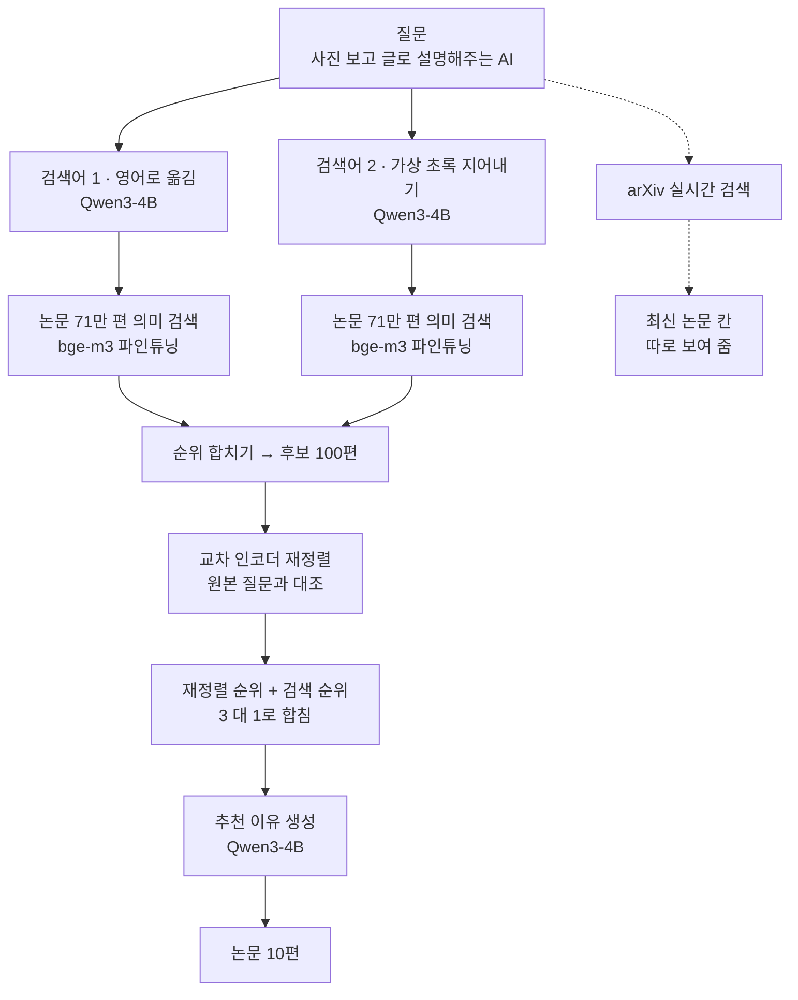

# Papers, Please

**한국어나 일상어로 물어도 arXiv 논문을 찾아 주는 검색 서비스.**

논문을 찾을 때 가장 큰 걸림돌은 자기가 읽고 싶은 논문이 실제로 어떤 말로 쓰여 있는지
모른다는 것이다. "사진 보고 글로 설명해주는 AI"라고 쳐도 논문은 `image captioning`
이라고 쓴다. 한국어로 물으면 arXiv는 아예 못 찾는다 — 시험용 342문항에서 한국어 질문
171개 중 128개(74.9%)가 결과 0건이었다.

Papers, Please는 질문을 그대로 키워드 검색에 넣는 대신 **영어로 옮기고, 그 질문에 답할
법한 초록을 지어내고, 논문 71만 편을 뜻으로 찾은 뒤, 사용자 의도와 맞는지 다시 줄
세운다.** 같은 342문항에서 arXiv 키워드 검색의 Recall@10이 0.190인데 이 시스템은
**0.658**이다.

비전문가를 위한 논문 검색 시스템 (졸업작품).

---

## 화면


*(화면 사진을 `assets/screenshot.png`에 넣으면 여기 나옵니다. 자세한 것은
[assets/README.md](assets/README.md) 참고)*

### 어떻게 동작하는가



**arXiv 실시간 검색 결과는 추천 목록에 섞지 않고 '최신 논문' 칸으로 따로 보여 준다.**
섞으면 비율을 어떻게 잡아도 만족도가 떨어졌다(전부 p<0.001). arXiv 채널의 가치는
정확도가 아니라 색인에 없는 최신 논문이다.

---

## 설치

### 1. 저장소와 파이썬 환경

```bash
git clone https://github.com/jmoongyu/Papers-Please.git
cd Papers-Please

python3 -m venv .venv
source .venv/bin/activate          # 윈도우는 .venv\Scripts\activate
pip install -r requirements.txt
```

GPU를 쓰려면 torch를 먼저 CUDA 빌드로 설치한다.

```bash
pip install torch --index-url https://download.pytorch.org/whl/cu126
```

### 2. 로컬 언어 모델 (Ollama)

번역, 가상 초록, 추천 이유 생성에 쓴다. [ollama.com](https://ollama.com)에서 받은 뒤:

```bash
ollama pull qwen3:4b
ollama serve
```

### 3. 논문 코퍼스 만들기

[Kaggle arXiv 데이터셋](https://www.kaggle.com/datasets/Cornell-University/arxiv)
(`arxiv-metadata-oai-snapshot.json`)을 받아 `data/corpus/`에 두고:

```bash
python -m src.retrieval.corpus \
    --kaggle data/corpus/arxiv-metadata-oai-snapshot.json \
    --out data/corpus/corpus-cs2021.jsonl \
    --prefixes cs. stat.ML eess. --min-year 2021 --sample 0
```

결과는 716,183편, 약 1GB다.

### 4. 의미 검색 색인 만들기

서비스는 파인튜닝한 검색 모델로 만든 `cs2021-ft` 색인을 쓴다. 아래
[학습](#학습-선택)으로 `models/retriever-ft`를 먼저 만든 뒤 색인을 만든다.

```bash
python -m src.retrieval.local_index \
    --corpus data/corpus/corpus-cs2021.jsonl \
    --model models/retriever-ft \
    --out data/embeddings/cs2021-ft
```

GPU로 약 3시간, 결과는 2.9GB다.

> 학습을 건너뛰고 원본 `BAAI/bge-m3`로만 색인을 만들려면 `--model`을 빼고
> `--out data/embeddings/cs2021`로 만든 뒤, `app.py`의 `LOCAL_INDEX`를 `"cs2021"`로
> `FUSE_RERANK_WEIGHT`를 `0`으로 바꾼다. 둘은 한 묶음이다.
> 시험용 342문항 Recall@10이 0.658에서 0.617로 내려간다.

---

## 사용법

### 웹 화면

```bash
streamlit run app.py          # → http://localhost:8501
```

첫 실행은 색인을 올리는 데 1분쯤 걸린다. 왼쪽 설정에서 로컬 의미 검색과 arXiv 실시간
검색을 각각 켜고 끌 수 있다.

### 성능 평가

```bash
# 파이프라인을 돌려 결과를 저장
python -m evaluation.pipeline_eval --queries data/eval/dev.jsonl \
    --channels local_dense local_hyde --rewriter service \
    --k 100 --rerank cross --rerank-depth 100 --out runs/dev_run.jsonl

# 저장된 결과를 보고 (검색 0회)
python -m evaluation.report --run runs/dev_run.jsonl \
    --queries data/eval/dev.jsonl --grades data/eval/grades_dev.jsonl

# 두 실행을 짝지어 비교 (통계 검정 포함). 기준선을 맨 앞에 둔다
python -m evaluation.report --run results/test_arxiv_only_raw.jsonl \
    results/test_ft_fused.jsonl --queries data/eval/test.jsonl

# 응답 시간 재기
python -m evaluation.pipeline_eval --bench-service --n 5
```

저장된 검색 결과에 설정만 바꿔 다시 집계할 수 있다. 검색을 다시 하지 않으므로 빠르고
arXiv도 다시 부르지 않는다.

```bash
python -m evaluation.pipeline_eval --report-only runs/dev_run.jsonl \
    --rerank cross --rerank-depth 100 --fuse-rerank 3.0
```

### 학습 (선택)

```bash
# 쿼리 변환기 - 지도 파인튜닝 다음에 선호 학습
python -m training.train sft --output-dir models/query-translator-sft
python -m training.train dpo --sft-adapter models/query-translator-sft/checkpoint-54 \
    --output-dir models/query-translator-dpo

# 검색 모델 파인튜닝 (서비스가 쓰는 것)
python -m training.build_retrieval_pairs --out data/training/train_retriever.jsonl
python -m training.train embed --output-dir models/retriever-ft
```

### 주요 설정값

전부 `app.py` 맨 위에 있고, 값마다 어떻게 정했는지 주석에 적혀 있다.

| 값 | 기본 | 무엇 |
|---|---|---|
| `LOCAL_INDEX` | `cs2021-ft` | 쓸 색인. 질문 임베딩 모델은 색인 파일에서 읽는다 |
| `DEPTH_LOCAL` | 100 | 검색어마다 가져올 후보 편수 |
| `RERANK_DEPTH` | 100 | 재정렬에 넣을 최대 후보 편수 |
| `FUSE_RERANK_WEIGHT` | 3.0 | 재정렬 순위와 검색 순위를 합칠 때 재정렬 쪽 가중치 |
| `MIN_RERANK_SCORE` | 0.002 | 이 아래는 "관련성이 낮아 접어 둔" 자리로 내린다 |
| `TOP_K` | 10 | 보여 줄 논문 편수 |

---

## 검색 성능

### 어떻게 쟀는가

**평가셋.** 논문에서 질문을 거꾸로 만들었다. 모델에게 **제목을 주지 않고 초록만 주어**,
"이 논문을 아직 못 찾은 사람"의 자리에서 질문을 쓰게 했다. 제목을 주고 어순만 바꾸게
했더니 정확한 용어를 쓰는 층의 Recall@10이 1.000이 나왔는데, 원인은 희귀 용어가 아니라
제목의 낱말 조합을 그대로 재현한 것이었다.

- **시험용 342문항** (`data/eval/test.jsonl`) — 확정 판정에만 쓴다
- **개발용 348문항** (`data/eval/dev.jsonl`) — 설정을 바꿔 보는 탐색은 전부 여기서 한다
- **같은 논문, 같은 난이도를 한국어와 영어로 짝지어** 만들었다. 그래서 언어별 차이가
  논문 차이와 섞이지 않는다
- 난이도 3층 — `easy` 대학원생의 학술어 / `medium` 학부연구생 / `hard` 1~2학년의 일상어

**지표.** 주 지표는 **Recall@10** — 상위 10편 안에 그 질문을 만든 논문이 들어왔는가.
등급 정답지가 필요 없어서 구성을 바꿔도 절대값이 움직이지 않는다.

**판정.** 같은 문항끼리 짝지은 부트스트랩 검정. **p가 0.05보다 크면 "차이가 없다"가
아니라 "있는지 없는지 모른다"**로 적는다.

### 적용 전후 (시험용 342문항, Recall@10)

| 무리 | 단순 arXiv API 키워드 검색 | **이 프로젝트** | 차이 |
|---|---|---|---|
| **전체** | 0.190 | **0.658** | **+0.468** |
| easy | 0.500 | 0.904 | +0.404 |
| medium | 0.061 | 0.737 | +0.675 |
| hard | 0.009 | 0.333 | +0.325 |
| **한국어** | 0.076 | **0.661** | **+0.585** |
| 영어 | 0.304 | 0.655 | +0.351 |

여섯 무리 전부 **p < 0.001**. 전체 신뢰구간 [+0.415, +0.520].

- 전: `results/test_arxiv_only_raw.jsonl` — 사용자 질문을 그대로 arXiv API에 넣음
- 후: `results/test_ft_fused.jsonl` — 지금 서비스 구성
- **한국어 질문 171개 중 128개(74.9%)가 arXiv에서 결과 0건.** 영어는 0건이 없었다

두 파일 다 저장돼 있으므로 직접 다시 계산할 수 있다.

```bash
python -m evaluation.report --run results/test_arxiv_only_raw.jsonl \
    results/test_ft_fused.jsonl --queries data/eval/test.jsonl
```

### 무엇이 성능을 만들었는가

개발용 348문항. 단계마다 하나씩만 더했다.

| 구성 | 전체 | easy | medium | hard | 한국어 | 영어 |
|---|---|---|---|---|---|---|
| ① 단순 arXiv 키워드 검색 | 0.086 | 0.233 | 0.026 | 0.000 | 0.017 | 0.155 |
| ② 쿼리 변환 + arXiv 검색 | 0.284 | 0.586 | 0.241 | 0.026 | 0.270 | 0.299 |
| ③ 로컬 의미 검색만 | 0.428 | 0.724 | 0.474 | 0.086 | 0.368 | 0.489 |
| ④ ③ + 한국어를 영어로 옮김 | 0.468 | 0.784 | 0.500 | 0.121 | 0.448 | 0.489 |
| ⑤ ④ + 가상 초록 검색어 추가 | 0.457 | 0.784 | 0.457 | 0.129 | 0.443 | 0.471 |
| ⑥ ⑤ + 교차 인코더 재정렬 | 0.575 | 0.914 | 0.629 | 0.181 | 0.575 | 0.575 |
| ⑦ ⑥ + 파인튜닝 검색 모델 | 0.618 | 0.914 | 0.672 | 0.267 | 0.615 | 0.621 |
| **⑧ ⑦ + 순위 합치기 3:1** | **0.635** | 0.914 | 0.681 | **0.310** | 0.632 | 0.638 |

**가장 큰 두 몫은 arXiv 키워드 검색을 로컬 의미 검색으로 바꾼 것(+0.144, p<0.001)과
교차 인코더 재정렬(+0.118, p<0.001)이다.** 둘이 전체 상승분의 절반이다.

**한국어와 영어의 격차가 닫혔다.**

```
①  한국어 0.017  영어 0.155   차이 0.138
④  한국어 0.448  영어 0.489   차이 0.041   <- 번역을 넣은 자리
⑧  한국어 0.632  영어 0.638   차이 0.006
```

### 응답 시간 (질문 5개, arXiv 채널 끔)

| 단계 | 중앙값 | 최대 | 비중 |
|---|---|---|---|
| 추천 이유 생성 | 10.8초 | 13.3초 | 59% |
| 재정렬 | 2.2초 | 2.9초 | 12% |
| 한국어를 영어로 옮기기 | 2.1초 | 2.9초 | 11% |
| 가상 초록 만들기 | 1.0초 | 2.6초 | 5% |
| 로컬 의미 검색 | 0.8초 | 1.1초 | 4% |
| **합계** | **18.3초** | **19.9초** | |

기준 30초를 넘은 질문 0/5개. 시작할 때 색인을 올리는 12.3초는 한 번만 든다.
**응답 시간의 59%가 추천 이유 생성이다.**

앞의 값(13.35초)보다 5초쯤 늘었다. 늘어난 것은 계산이 아니라 **모델을 올리는 시간**이다.
그래픽 메모리를 4GB 안에 맞추려고 검색이 도는 동안에만 모델을 올리기 때문이다
([그래픽 메모리](#그래픽-메모리) 참고). "한국어를 영어로 옮기기" 2.1초와 "재정렬" 2.2초에
각각 모델 적재가 들어 있다. 대신 검색을 안 할 때는 그래픽 메모리를 거의 쓰지 않는다.

### 함께 적어야 할 것

- **일상어 층(hard)은 0.333으로 여전히 낮다.** 다만 이 층의 질문 중 상당수에는 정답
  논문이 아니어도 쓸모 있는 논문을 상위 10편에 보여 준다
- **지금 구성을 채택한 근거는 전체 성능이 아니다.** 옛 구성 대비 전체 +0.041인데
  **p=0.085로 유의성을 확보하지 못했다**(신뢰구간 [−0.003, +0.085]). 개발용에서는
  +0.060(p=0.003)이었고 시험용에서 방향과 크기가 재현됐으나 342문항으로는 이 크기를
  잡아낼 힘이 모자란다. 채택 근거는 ⓐ 유의미하게 나빠진 무리가 하나도 없고
  ⓑ **한국어가 유의미하게 좋아졌다**는 것이다(+0.070, p=0.045)
- **반증된 것도 그대로 남겼다.** 의도→개념→용어로 단계를 밟는 계층 변환은 세 번 측정해
  세 번 반증됐고, 재정렬기를 우리 자료로 파인튜닝하는 것은 세 번 시도해 세 번 실패했다.
  두 손실 함수 모두 점수의 절대값을 고정하는 항이 없어서, 순서는 가르쳐도 "무관한 것은
  0에 가깝게"는 못 가르친다. 대신 **재정렬 순위와 검색 순위를 합치는 것**이 같은
  목표를 학습 0시간으로 달성했다

---

## 폴더 구조

| 위치 | 무엇 |
|---|---|
| `app.py` | 웹 화면 (Streamlit) |
| `src/rewriter/` | 쿼리 변환 — 번역 · 가상 초록 · 학습한 모델 · 특정 논문 지목 |
| `src/retrieval/` | 검색 — 코퍼스 · 로컬 색인 · arXiv · 순위 합치기와 재정렬 |
| `src/recommend_agent/` | 추천 이유 생성 |
| `evaluation/` | 평가셋 제작 · 파이프라인 실행 · 지표 · 보고 |
| `training/` | 학습 — 쿼리 변환기 · 검색 모델 · 재정렬기 |
| `data/eval/` | 평가셋 4개 (`dev` · `test` · `grades_dev` · `grades_test`) |
| `results/` | 보고서가 인용하는 확정 결과. [설명](results/README.md) |

**디렉터리마다 코드 파일은 4개를 넘지 않는다.** 새 기능은 되도록 기존 파일에 넣는다.

평가 실행 방법은 [evaluation/README.md](evaluation/README.md)에 자세히 있다.

---

## 쓴 모델

| 자리 | 모델 | 어디서 | 그래픽 메모리 |
|---|---|---|---|
| 번역 · 가상 초록 · 추천 이유 | `qwen3:4b` | Ollama 4비트 | 3.25GB |
| arXiv 검색어 생성 | `Qwen3-4B-Instruct-2507` + LoRA를 합쳐 4비트로 | Ollama `papers-rewriter` | 3.2GB |
| 재정렬 | `BAAI/bge-reranker-v2-m3` | float16 사본 | 1.24GB |
| 질문 임베딩 | `BAAI/bge-m3`를 파인튜닝한 `models/retriever-ft` | CPU float32 | 0 |

두 언어 모델은 같은 시각에 올라가지 않는다. 자세한 것은 [그래픽 메모리](#그래픽-메모리) 참고.

**서비스가 도는 동안 유료 인공지능 서비스를 부르지 않는다.** OpenAI는 평가셋을 미리
만들 때만 쓴다.

### 그래픽 메모리

검색 한 번은 서로 겹치지 않는 세 구간으로 나뉘고, 구간이 바뀔 때 반대편 모델을 내린다.
언어 모델 하나가 3.25GB라 재정렬 모델과 같은 시각에 올라가면 4.76GB가 되기 때문이다.

| 구간 | 올라가는 것 | 카드 사용량 |
|---|---|---|
| 1 · 논문 지목 · 번역 · 가상 초록 | Ollama `qwen3:4b` | 3.26GB |
| 1-2 · arXiv 검색어 변환 | Ollama `papers-rewriter` (교체) | 3.23GB |
| 2 · 로컬 의미 검색 · 재정렬 | 재정렬 모델만 | 1.49GB |
| 3 · 추천 이유 | Ollama `qwen3:4b` (교체) | 3.51GB |
| 검색이 끝난 뒤 | CUDA 컨텍스트만 | 0.27GB |

**기본 설정에서 최대 3.3GB.** 검색을 안 할 때는 거의 쓰지 않는다.

### 왜 4비트인가

변환기를 4비트로 줄이면 검색 최대치가 3.3GB로 내려간다. 정밀도를 올린 판도 만들어
재봤다. 시험용 342문항, arXiv 채널만 잰 값이다.

| 정밀도 | 검색 최대치 | Recall@10 | MRR@10 | nDCG@10 |
|---|---|---|---|---|
| **q4_K_M (쓰는 것)** | **3.3GB** | 0.360 | 0.312 | 0.385 |
| q8_0 | 5.0GB | 0.380 | 0.330 | 0.400 |
| f16 (양자화 없음) | 8.7GB | 0.386 | 0.336 | 0.405 |

f16 기준으로 q8_0은 세 지표 모두 판정 불가이고(차이 0.006 이하), q4_K_M은
MRR(p=0.034)과 nDCG(p=0.002)가 유의미하게 낮다. Recall은 셋 다 구분되지 않는다.

**q8_0이 품질 대비 이득이 크지만 4비트를 쓴다.** 4GB 목표를 지키려는 것이고,
**이 변환기가 바꾸는 것은 arXiv '최신 논문' 칸뿐이기 때문이다.** 추천 논문 10편은
번역기와 가상 초록 생성기(둘 다 `qwen3:4b`)가 만든 검색어로 찾으므로 이 변환기와
무관하다. 자세한 것은 [results/README.md](results/README.md) 참고.

서비스를 돌리기 전에 두 가지를 미리 만들어야 한다.

```bash
# arXiv 검색어 변환기를 Ollama에 등록 (llama.cpp 변환 스크립트 필요)
python -m training.export ollama --llama-cpp ~/llama.cpp --grades basic

# 재정렬 모델 float16 사본 (적재가 5.4초에서 1.8초로 줄어든다)
python -m training.export fp16
```

둘 다 없어도 앱은 뜬다. `papers-rewriter`가 없으면 arXiv 채널이 변환 없이 원본 질문으로
검색하고 화면에 그렇게 알린다. `--grades`를 빼면 q8_0과 f16 판까지 만든다 (성능을
견주려고 재본 것이고 서비스는 쓰지 않는다). float16 사본이 없으면 원본을 읽어 검색마다 3.6초를 더 쓴다.
로컬 검색과 추천은 둘 다 영향받지 않는다.

모델 가중치와 색인은 크기 때문에 저장소에 없다. 위 [설치](#설치)와
[학습](#학습-선택) 절차로 다시 만들 수 있다.

---

## arXiv 이용 정책

- 제목, 초록, 논문 번호 같은 메타데이터는 CC0 1.0으로 배포되어 저장과 재사용이 된다.
  **논문 원문은 이 서비스가 제공하지 않고 arXiv 초록 페이지로 보낸다.**
- arXiv API는 요청 간 3초 간격, 단일 연결을 지켜야 한다. 코드가 지킨다.
-이 서비스는 arXiv와 무관한 프로젝트이며 arXiv의 후원이나 보증을 받지 않았다.

> Thank you to arXiv for use of its open access interoperability.
> This service was not reviewed or approved by, nor does it necessarily express
> or reflect the policies or opinions of, arXiv.

---

## 라이선스

[MIT](LICENSE)
